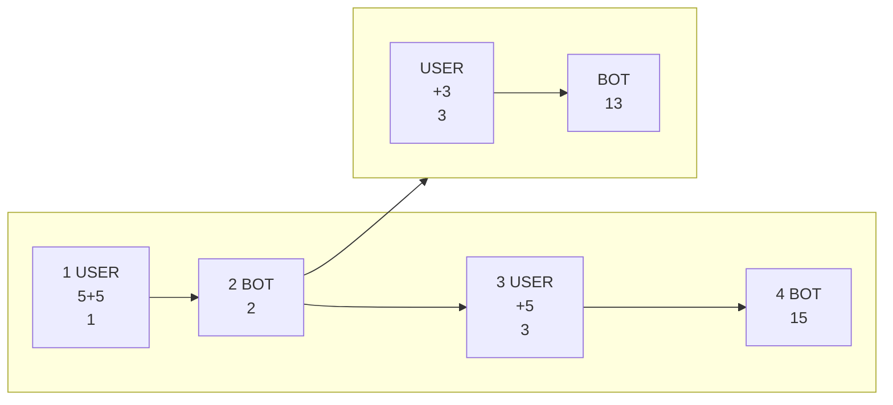
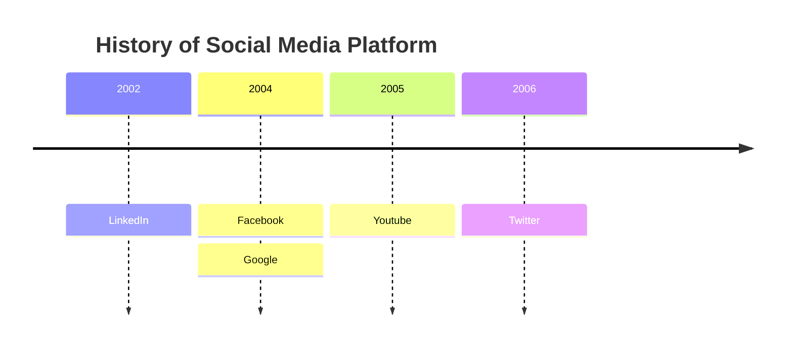

Messages sequences are represented as *spindles.* A spindle is a 3d graph using the following set of dimensions.

# Dimensions

## Chainwise
Chainwise means in the direction of the message chain. So for instance the following direction is *chainwise*. The chainwise position of each message is the number shown.

Chainwise is the natural direction of conversation flow.
## Branching
A branch is an alternative sequence of messages. Here is an example of a branch. 

Branchwise is defined as the direction in which messages branch out into alternative 