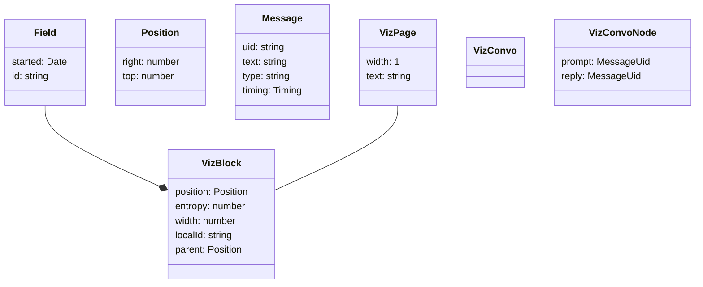

```mermaid
classDiagram
	class Field {
		started: Date
		id: string
	}
	Field --* VizBlock

	class Position {
		right: number
		top: number
	}  
	class VizBlock {
		position: Position 
		entropy: number
		width: number
		localId: string
		parent: Position
	}
	
	class Message {
		uid: string
		text: string
		type: string
		timing: Timing
	}
	VizPage--VizBlock
	class VizPage {
		width: 1
		text: string
	}
	class VizConvo {
		
	}
	class VizConvoNode {
		prompt: MessageUid
		reply: MessageUid
		
	}
	

	
```

